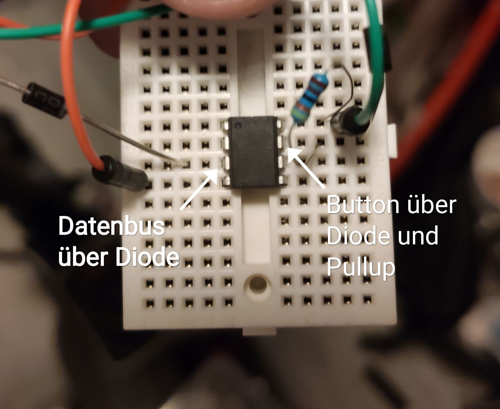

# Docgreen Esa 5000 Arduino Setspeed Button
Use this arduino sketch and connect your arduino to your docgreen ESA 5000 Escooter. You can define a sequence that you have to press the powerbutton of your scooter to set a new speed limit.

# Tested Boards
- Arduino Pro Mini
- Arduino Nano
- ATtiny45

#ToDo ESP-01, ESP8266

# Connect Your Arduino 
Connect your arduino like in this project: https://Github.Com/M4gnv5/Docgreenesa5000-Dashboard
5V power and databus should now connected between the scooter and your arduino.

Now you have to connect the green cable that connects the scooters dashboard with the scooters controller motherboard. It gets pulled to ground/0V when you press the button. You have to use a diode and a pullup resistor as shown in the following picture:

When you use this sketch without modification, you have to connect the button to Pin 14 on your arduino.

ATtiny45: Use PIN 4 for Databus (with Diode as in Picture above) and PIN 2 as Button PIN (with Diode as in Picture above).

# Usage

After turning on your scooter, the arduino will get powered too. Klick 6 times fast on the power button and the scooters max speed will be 30 kilometers/h. Three more times and the scooters max speed will reset to default 20 kilometers/h. You now have to turn your scooter off and on again.
